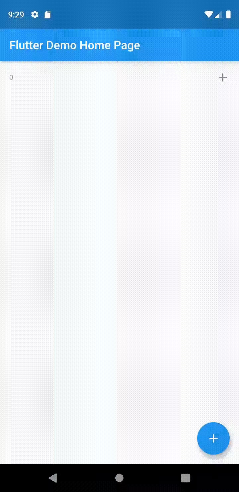

# provider_app

For Flutter Testing with Provider

## Getting Started

This project is a starting point for a Flutter with Provider application.

## A preview of the code main.dart

Separation of Widgets making it readible and fluid

```
void main() => runApp(MyApp());

class MyApp extends StatelessWidget {
  // This widget is the root of your application.
  @override
  Widget build(BuildContext context) {
    return
      MultiProvider(
        providers: [
          ChangeNotifierProvider(builder: (_)=>Counter(),),
          ChangeNotifierProvider(builder: (_)=>CounterModel(),),
         
        ],
        child: MaterialApp(
          debugShowCheckedModeBanner: false,
          title: 'Flutter Demo',
          theme: ThemeData(

            primarySwatch: Colors.blue,
          ),
          home: MyTaskApp(title: 'Flutter Demo Home Page'),

    ),
      );
  }
}


class MyTaskApp extends StatelessWidget {

  MyTaskApp({Key key, this.title}) : super(key: key);


  final String title;

  @override
  Widget build(BuildContext context) {


    return Scaffold(

      appBar: AppBar(

        title: Text(this.title),
      ),
      body: ListView(
        children:
        Provider.of<CounterModel>(context).allTasks.map((item) {

          return  ChangeNotifierProvider<Counter>.value(value: item,
            child: Dismissible(
              key: ValueKey(item),
              child: MyTaskItem(),
              onDismissed: (direction){
                Provider.of<CounterModel>(context).deleteTask(item);
              },
            ),);
        }) .toList()
        ,
      ),
      floatingActionButton: MyFloatingButton(
        onPressed: (){
          Provider.of<CounterModel>(context).addTask(
              Counter()
          );


        },
      ),

    );
  }

}

class Counter with ChangeNotifier {

  int _count=0;
  int get count=>_count;


  void increment(){
    _count+=1;
    notifyListeners();
  }
}

class CounterModel with ChangeNotifier {
  List<Counter> _counters=[
    Counter(),
  ];

  UnmodifiableListView<Counter> get allTasks=>UnmodifiableListView(_counters);

  void addTask(Counter counter){

    _counters.add(counter);
    notifyListeners();
  }

  void deleteTask(Counter counter){
    _counters.remove(counter);
    notifyListeners();
  }


}

class MyFloatingButton extends StatelessWidget{
 final VoidCallback onPressed;


  MyFloatingButton({this.onPressed});
  @override
  Widget build(BuildContext context) {


    return FloatingActionButton(
      onPressed: onPressed??Provider.of<Counter>(context).increment,
      child: Icon(Icons.add,color: Colors.white,),
    );
  }


}


class MyTaskItem extends StatelessWidget {
  @override
  Widget build(BuildContext context) {
    return ListTile(
      title: Text("${
      Provider.of<Counter>(context).count
      }",
       style: TextStyle(
         fontSize:Provider.of<Counter>(context).count>10? 30:12,
             fontWeight: Provider.of<Counter>(context).count>20?FontWeight.bold:FontWeight.normal,
         color: Provider.of<Counter>(context).count>10?Colors.red:Colors.grey
       ),
      ),
      trailing: InkWell(
        onTap: Provider.of<Counter>(context).increment,
        child: Icon(Provider.of<Counter>(context).count>10?Icons.refresh:Icons.add),
      ),
    );
  }
}
```

- 

A few resources to get you started if this is your first Flutter project:

- [Lab: Write your first Flutter app](https://flutter.dev/docs/get-started/codelab)
- [Cookbook: Useful Flutter samples](https://flutter.dev/docs/cookbook)

For help getting started with Flutter, view our 
[online documentation](https://flutter.dev/docs), which offers tutorials, 
samples, guidance on mobile development, and a full API reference.
